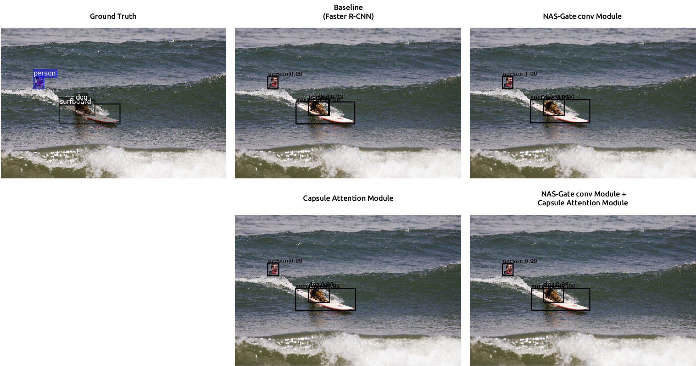

# Object Detectors Involving a NAS-gate Convolutional Module and Capsule Attention Module

- This code is an official implementation of '*Object Detectors Involving a NAS-gate Convolutional Module and Capsule Attention Module*' base on the open source object detection toolbox [mmdetection](https://github.com/open-mmlab/mmdetection)

## Environment
-  Python 3.7
-  Pytorch 1.5
-  mmedeteion version 2.0
-  mmcv version 1.0.4

## Result
### PASCAL_VOC

|**Method**| **Backbone** | **mAP_50**|
|----------|--------------|-----------|
|NASGC-CapANet (Faster R-CNN w FPN)| ResNet-50 | 81.96 |
|NASGC-CapANet (Faster R-CNN w FPN)| ResNet-101 | 82.64 |
|NASGC-CapANet (Faster R-CNN w PAFPN)| ResNet-50 | 82.36 |
|NASGC-CapANet (Faster R-CNN w PAFPN)| ResNet-101 | 82.70 |

### MS COCO

|**Method**| **Backbone** | **mAP**|**mAP_50**|**mAP_75**|**mAP_S**|**mAP_M**|**mAP_L**|
|----------|--------------|-----------|-----------|-----------|-----------|-----------|-----------|
|NASGC-CapANet (RetinaNet)| ResNet-101 | 41.1 | 60.8 | 44.1 | 23.0 | 44.1 | 52.7 |
|NASGC-CapANet (FCOS w GN and w/o MS training)| ResNet-101 | 41.3 | 60.8 | 44.4 | 23.3 | 44.3 | 52.6 |
|NASGC-CapANet (Faster R-CNN w FPN)| ResNet-50 | 40.3 | 61.5 | 43.9 | 23.1 | 43.0 | 50.6 |
|NASGC-CapANet (Faster R-CNN w FPN)| ResNet-101 | 41.7 | 62.6 | 45.4 | 23.6 | 44.6 | 53.0 |
|NASGC-CapANet (Faster R-CNN w PAFPN)| ResNet-101 | 42.0 | 62.7 | 45.8 | 23.8 | 45.0 | 53.3 |
|NASGC-CapANet (Faster R-CNN w PAFPN)| ResNet-101 | 43.8 | 62.8 | 47.7 | 24.7 | 46.6 | 56.5 |

### Image result on MS COCO

  

  

